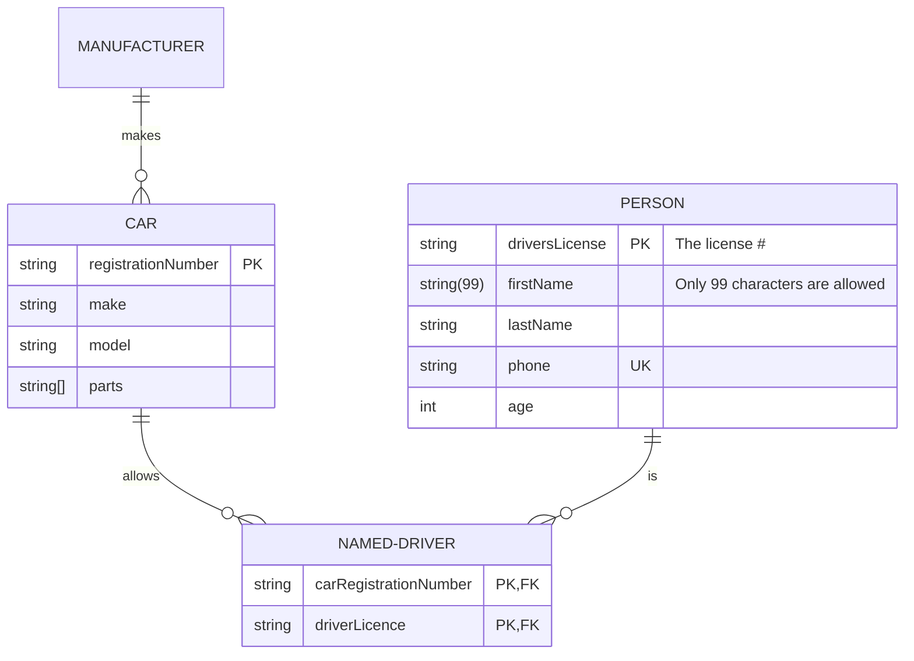
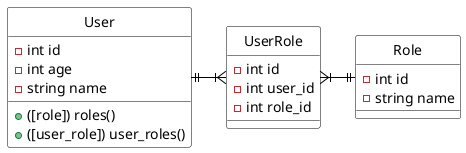

```mermaid
erDiagram
    CAR ||--o{ NAMED-DRIVER : allows
    CAR {
        string registrationNumber PK
        string make
        string model
        string[] parts
    }
    PERSON ||--o{ NAMED-DRIVER : is
    PERSON {
        string driversLicense PK "The license #"
        string(99) firstName "Only 99 characters are allowed"
        string lastName
        string phone UK
        int age
    }
    NAMED-DRIVER {
        string carRegistrationNumber PK, FK
        string driverLicence PK, FK
    }
    MANUFACTURER only one to zero or more CAR : makes
```

```plantuml
@startuml
  skinparam linetype ortho
  skinparam packageStyle rectangle
  skinparam shadowing false
  skinparam class {
    BackgroundColor White
    BorderColor Black
    ArrowColor Black
  }
  hide circle
  class "User" as User1 {
    - int id
    - int age
    - string name
    + ([role]) roles()
    + ([user_role]) user_roles()
  }
  class Role {
    - int id
    - string name
  }
  class "UserRole" as User1Role {
    - int id
    - int user_id
    - int role_id
  }
  User1 ||-right-|{ User1Role
  Role ||-left-|{ User1Role
@enduml
```