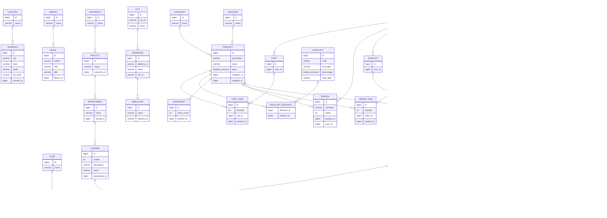

```mermaid
erDiagram
    ADDRESS {
        bigint id
        varchar city
        varchar state
        varchar street
        varchar zip_code
        bigint country_id
    }
    COUNTRY ||--o{ ADDRESS : ""
    ADDRESS2 {
        bigint id
        varchar address_id
        varchar street
        varchar city_id
    }
    CITY ||--o{ ADDRESS2 : ""
    BOOK {
        bigint id
        varchar author
        varchar isbn
        varchar title
        bigint library_id
    }
    LIBRARY ||--o{ BOOK : ""
    CART {
        bigint id
        bigint user_id
    }
    user ||--o{ CART : ""
    CART_ITEM {
        bigint id
        int quantity
        bigint cart_id
        bigint product_id
    }
    CART ||--o{ CART_ITEM : ""
    PRODUCT ||--o{ CART_ITEM : ""
    CATEGORY {
        bigint id
        varchar name
    }
    CITY {
        bigint id
        varchar city_id
        varchar name
    }
    CLUB {
        bigint id
        varchar name
    }
    COUNTRY {
        bigint id
        varchar name
    }
    COURSE {
        bigint id
        int credits
        varchar description
        varchar name
        bigint department_id
    }
    DEPARTMENT ||--o{ COURSE : ""
    DEPARTMENT {
        bigint id
        varchar name
        bigint faculty_id
    }
    FACULTY ||--o{ DEPARTMENT : ""
    DISCOUNT {
        bigint id
        varchar code
        varchar end_date
        double_precision percentage
        varchar start_date
    }
    DISCOUNT_PRODUCT {
        bigint discount_id
        bigint product_id
    }
    DISCOUNT ||--o{ DISCOUNT_PRODUCT : ""
    PRODUCT ||--o{ DISCOUNT_PRODUCT : ""
    EMPLOYEE {
        bigint id
        varchar name
        varchar address_id
    }
    ADDRESS2 ||--o{ EMPLOYEE : ""
    FACULTY {
        bigint id
        varchar name
        bigint university_id
    }
    UNIVERSITY ||--o{ FACULTY : ""
    INVENTORY {
        bigint id
        int stock_count
        bigint product_id
    }
    PRODUCT ||--o{ INVENTORY : ""
    LIBRARY {
        bigint id
        varchar name
    }
    ORDER_ITEM {
        bigint id
        int quantity
        bigint order_id
        bigint product_id
    }
    PRODUCT ||--o{ ORDER_ITEM : ""
    order ||--o{ ORDER_ITEM : ""
    PAYMENT {
        bigint id
        double_precision amount
        varchar date
        varchar payment_type
        bigint order_id
    }
    order ||--o{ PAYMENT : ""
    PRODUCT {
        bigint id
        varchar description
        varchar name
        double_precision price
        bigint category_id
        bigint supplier_id
    }
    CATEGORY ||--o{ PRODUCT : ""
    SUPPLIER ||--o{ PRODUCT : ""
    PROFESSOR {
        bigint id
        varchar first_name
        varchar last_name
        varchar specialization
    }
    REVIEW {
        bigint id
        varchar comment
        int rating
        bigint product_id
        bigint user_id
    }
    PRODUCT ||--o{ REVIEW : ""
    user ||--o{ REVIEW : ""
    SHIPMENT {
        bigint id
        varchar status
        varchar tracking_number
        bigint order_id
    }
    order ||--o{ SHIPMENT : ""
    STAFF {
        bigint id
        varchar first_name
        varchar last_name
        varchar position
        double_precision salary
    }
    STUDENT {
        bigint id
        varchar date_of_birth
        varchar email
        varchar enrollment_date
        varchar first_name
        double_precision grade_average
        varchar last_name
        bigint advisor_id
    }
    PROFESSOR ||--o{ STUDENT : ""
    STUDENT_CLUB {
        bigint club_id
        bigint student_id
    }
    CLUB ||--o{ STUDENT_CLUB : ""
    STUDENT ||--o{ STUDENT_CLUB : ""
    STUDENT_COURSE {
        bigint student_id
        bigint course_id
    }
    COURSE ||--o{ STUDENT_COURSE : ""
    STUDENT ||--o{ STUDENT_COURSE : ""
    SUPPLIER {
        bigint id
        varchar name
    }
    UNIVERSITY {
        bigint id
        varchar name
    }
    USER_PROFILE {
        bigint id
        varchar date_of_birth
        varchar first_name
        varchar last_name
    }
    WISHLIST {
        bigint id
        bigint user_id
    }
    user ||--o{ WISHLIST : ""
    WISHLIST_PRODUCT {
        bigint wishlist_id
        bigint product_id
    }
    PRODUCT ||--o{ WISHLIST_PRODUCT : ""
    WISHLIST ||--o{ WISHLIST_PRODUCT : ""
    order {
        bigint id
        varchar date
        varchar status
        double_precision total_amount
        bigint user_id
    }
    user ||--o{ order : ""
    user {
        bigint id
        varchar email
        varchar password
        varchar username
    }

```