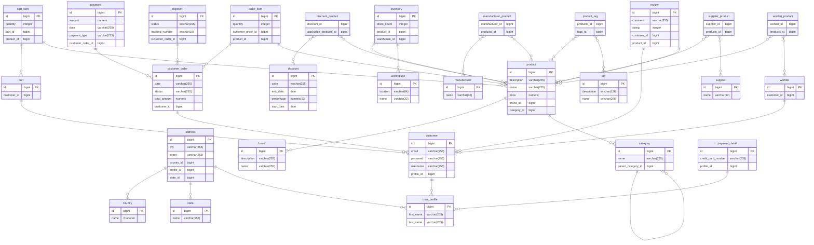

```mermaid
erDiagram
    address {
        id bigint PK
        city varchar(255)
        street varchar(255)
        country_id bigint
        profile_id bigint
        state_id bigint
    }
    address ||--o{ country : ""
    address ||--o{ state : ""
    address ||--o{ user_profile : ""
    brand {
        id bigint PK
        description varchar(255)
        name varchar(255)
    }
    cart {
        id bigint PK
        customer_id bigint
    }
    cart ||--o{ customer : ""
    cart_item {
        id bigint PK
        quantity integer
        cart_id bigint
        product_id bigint
    }
    cart_item ||--o{ cart : ""
    cart_item ||--o{ product : ""
    category {
        id bigint PK
        name varchar(255)
        parent_category_id bigint
    }
    category ||--o{ category : ""
    country {
        id bigint PK
        name character
    }
    customer {
        id bigint PK
        email varchar(255)
        password varchar(255)
        username varchar(255)
        profile_id bigint
    }
    customer ||--o{ user_profile : ""
    customer_order {
        id bigint PK
        date varchar(255)
        status varchar(255)
        total_amount numeric
        customer_id bigint
    }
    customer_order ||--o{ customer : ""
    discount {
        id bigint PK
        code varchar(255)
        end_date date
        percentage numeric(53)
        start_date date
    }
    discount_product {
        discount_id bigint
        applicable_products_id bigint
    }
    discount_product o{--o{ discount : ""
    discount_product o{--o{ product : ""
    inventory {
        id bigint PK
        stock_count integer
        product_id bigint
        warehouse_id bigint
    }
    inventory ||--o{ product : ""
    inventory ||--o{ warehouse : ""
    manufacturer {
        id bigint PK
        name varchar(32)
    }
    manufacturer_product {
        manufacturer_id bigint
        products_id bigint
    }
    manufacturer_product o{--o{ manufacturer : ""
    manufacturer_product o{--o{ product : ""
    order_item {
        id bigint PK
        quantity integer
        customer_order_id bigint
        product_id bigint
    }
    order_item ||--o{ customer_order : ""
    order_item ||--o{ product : ""
    payment {
        id bigint PK
        amount numeric
        date varchar(255)
        payment_type varchar(255)
        customer_order_id bigint
    }
    payment ||--o{ customer_order : ""
    payment_detail {
        id bigint PK
        credit_card_number varchar(255)
        profile_id bigint
    }
    payment_detail ||--o{ user_profile : ""
    product {
        id bigint PK
        description varchar(255)
        name varchar(255)
        price numeric
        brand_id bigint
        category_id bigint
    }
    product ||--o{ brand : ""
    product ||--o{ category : ""
    product_tag {
        products_id bigint
        tags_id bigint
    }
    product_tag o{--o{ product : ""
    product_tag o{--o{ tag : ""
    review {
        id bigint PK
        comment varchar(255)
        rating integer
        customer_id bigint
        product_id bigint
    }
    review ||--o{ customer : ""
    review ||--o{ product : ""
    shipment {
        id bigint PK
        status varchar(255)
        tracking_number varchar(16)
        customer_order_id bigint
    }
    shipment ||--o{ customer_order : ""
    state {
        id bigint PK
        name varchar(255)
    }
    supplier {
        id bigint PK
        name varchar(64)
    }
    supplier_product {
        supplier_id bigint
        products_id bigint
    }
    supplier_product o{--o{ product : ""
    supplier_product o{--o{ supplier : ""
    tag {
        id bigint PK
        description varchar(128)
        name varchar(255)
    }
    user_profile {
        id bigint PK
        first_name varchar(255)
        last_name varchar(255)
    }
    warehouse {
        id bigint PK
        location varchar(64)
        name varchar(32)
    }
    wishlist {
        id bigint PK
        customer_id bigint
    }
    wishlist ||--o{ customer : ""
    wishlist_product {
        wishlist_id bigint
        products_id bigint
    }
    wishlist_product o{--o{ product : ""
    wishlist_product o{--o{ wishlist : ""

```