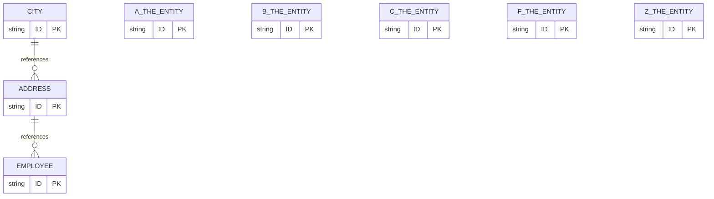

```mermaid
erDiagram
    ADDRESS {
        string ID PK
    }
    CITY ||--o{ ADDRESS : references
    A_THE_ENTITY {
        string ID PK
    }
    B_THE_ENTITY {
        string ID PK
    }
    CITY {
        string ID PK
    }
    C_THE_ENTITY {
        string ID PK
    }
    EMPLOYEE {
        string ID PK
    }
    ADDRESS ||--o{ EMPLOYEE : references
    F_THE_ENTITY {
        string ID PK
    }
    Z_THE_ENTITY {
        string ID PK
    }

```