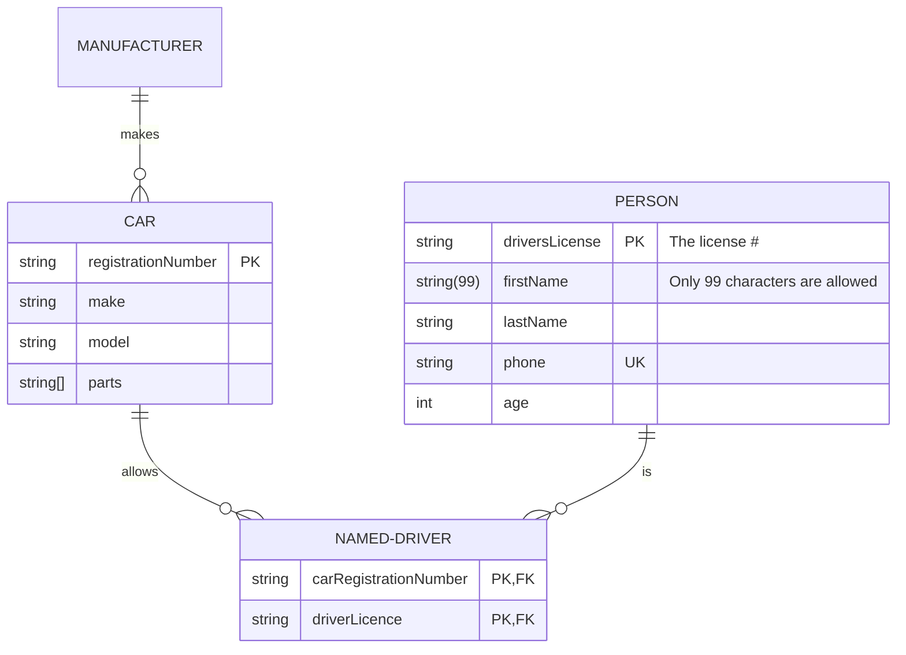
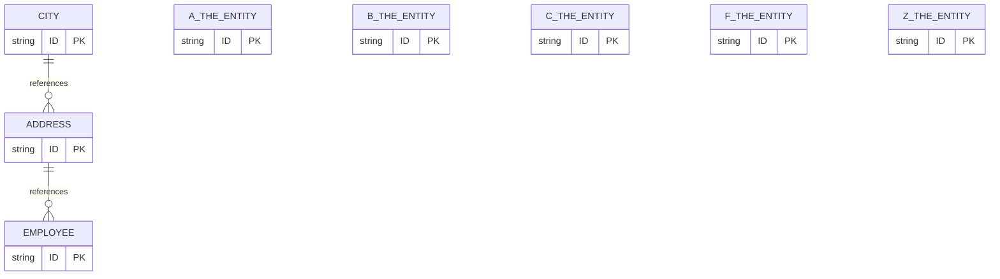

```mermaid
erDiagram
    CAR ||--o{ NAMED-DRIVER : allows
    CAR {
        string registrationNumber PK
        string make
        string model
        string[] parts
    }
    PERSON ||--o{ NAMED-DRIVER : is
    PERSON {
        string driversLicense PK "The license #"
        string(99) firstName "Only 99 characters are allowed"
        string lastName
        string phone UK
        int age
    }
    NAMED-DRIVER {
        string carRegistrationNumber PK, FK
        string driverLicence PK, FK
    }
    MANUFACTURER only one to zero or more CAR : makes
```

```mermaid
erDiagram
    ADDRESS {
        string ID PK
    }
    CITY ||--o{ ADDRESS : references
    A_THE_ENTITY {
        string ID PK
    }
    B_THE_ENTITY {
        string ID PK
    }
    CITY {
        string ID PK
    }
    C_THE_ENTITY {
        string ID PK
    }
    EMPLOYEE {
        string ID PK
    }
    ADDRESS ||--o{ EMPLOYEE : references
    F_THE_ENTITY {
        string ID PK
    }
    Z_THE_ENTITY {
        string ID PK
}
```
