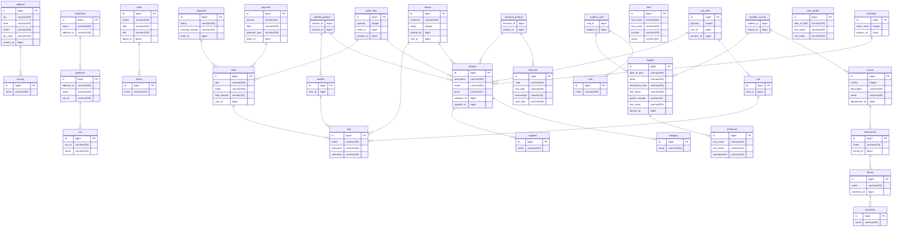

```mermaid
erDiagram
    address {
        id bigint PK
        city varchar(255)
        state varchar(255)
        street varchar(255)
        zip_code varchar(255)
        country_id bigint
    }
    address ||--o{ country : ""
    address2 {
        id bigint PK
        address_id varchar(255)
        street varchar(255)
        city_id varchar(255)
    }
    address2 ||--o{ city : ""
    book {
        id bigint PK
        author varchar(255)
        isbn varchar(255)
        title varchar(255)
        library_id bigint
    }
    book ||--o{ library : ""
    cart {
        id bigint PK
        user_id bigint
    }
    cart ||--o{ user : ""
    cart_item {
        id bigint PK
        quantity integer
        cart_id bigint
        product_id bigint
    }
    cart_item ||--o{ cart : ""
    cart_item ||--o{ product : ""
    category {
        id bigint PK
        name varchar(255)
    }
    city {
        id bigint PK
        city_id varchar(255)
        name varchar(255)
    }
    club {
        id bigint PK
        name varchar(255)
    }
    country {
        id bigint PK
        name varchar(255)
    }
    course {
        id bigint PK
        credits integer
        description varchar(255)
        name varchar(255)
        department_id bigint
    }
    course ||--o{ department : ""
    department {
        id bigint PK
        name varchar(255)
        faculty_id bigint
    }
    department ||--o{ faculty : ""
    discount {
        id bigint PK
        code varchar(255)
        end_date varchar(255)
        percentage numeric(53)
        start_date varchar(255)
    }
    discount_product {
        discount_id bigint
        product_id bigint
    }
    discount_product ||--o{ discount : ""
    discount_product ||--o{ product : ""
    employee {
        id bigint PK
        name varchar(255)
        address_id varchar(255)
    }
    employee ||--o{ address2 : ""
    faculty {
        id bigint PK
        name varchar(255)
        university_id bigint
    }
    faculty ||--o{ university : ""
    inventory {
        id bigint PK
        stock_count integer
        product_id bigint
    }
    inventory ||--o{ product : ""
    library {
        id bigint PK
        name varchar(255)
    }
    order_item {
        id bigint PK
        quantity integer
        order_id bigint
        product_id bigint
    }
    order_item ||--o{ product : ""
    order_item ||--o{ order : ""
    payment {
        id bigint PK
        amount numeric(53)
        date varchar(255)
        payment_type varchar(255)
        order_id bigint
    }
    payment ||--o{ order : ""
    product {
        id bigint PK
        description varchar(255)
        name varchar(255)
        price numeric(53)
        category_id bigint
        supplier_id bigint
    }
    product ||--o{ category : ""
    product ||--o{ supplier : ""
    professor {
        id bigint PK
        first_name varchar(255)
        last_name varchar(255)
        specialization varchar(255)
    }
    review {
        id bigint PK
        comment varchar(255)
        rating integer
        product_id bigint
        user_id bigint
    }
    review ||--o{ product : ""
    review ||--o{ user : ""
    shipment {
        id bigint PK
        status varchar(255)
        tracking_number varchar(255)
        order_id bigint
    }
    shipment ||--o{ order : ""
    staff {
        id bigint PK
        first_name varchar(255)
        last_name varchar(255)
        position varchar(255)
        salary numeric(53)
    }
    student {
        id bigint PK
        date_of_birth varchar(255)
        email varchar(255)
        enrollment_date varchar(255)
        first_name varchar(255)
        grade_average numeric(53)
        last_name varchar(255)
        advisor_id bigint
    }
    student ||--o{ professor : ""
    student_club {
        club_id bigint
        student_id bigint
    }
    student_club ||--o{ club : ""
    student_club ||--o{ student : ""
    student_course {
        student_id bigint
        course_id bigint
    }
    student_course ||--o{ course : ""
    student_course ||--o{ student : ""
    supplier {
        id bigint PK
        name varchar(255)
    }
    university {
        id bigint PK
        name varchar(255)
    }
    user_profile {
        id bigint PK
        date_of_birth varchar(255)
        first_name varchar(255)
        last_name varchar(255)
    }
    wishlist {
        id bigint PK
        user_id bigint
    }
    wishlist ||--o{ user : ""
    wishlist_product {
        wishlist_id bigint
        product_id bigint
    }
    wishlist_product ||--o{ product : ""
    wishlist_product ||--o{ wishlist : ""
    order {
        id bigint PK
        date varchar(255)
        status varchar(255)
        total_amount numeric(53)
        user_id bigint
    }
    order ||--o{ user : ""
    user {
        id bigint PK
        email varchar(255)
        password varchar(255)
        username varchar(255)
    }

```