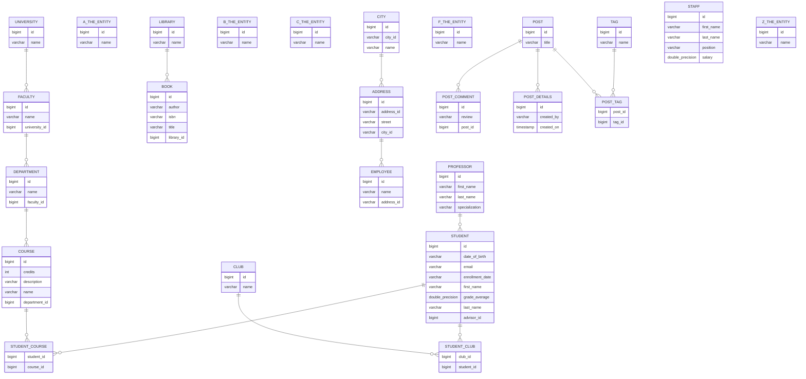

```mermaid
erDiagram
    ADDRESS {
        bigint id
        varchar address_id
        varchar street
        varchar city_id
    }
    CITY ||--o{ ADDRESS : ""
    A_THE_ENTITY {
        bigint id
        varchar name
    }
    BOOK {
        bigint id
        varchar author
        varchar isbn
        varchar title
        bigint library_id
    }
    LIBRARY ||--o{ BOOK : ""
    B_THE_ENTITY {
        bigint id
        varchar name
    }
    CITY {
        bigint id
        varchar city_id
        varchar name
    }
    CLUB {
        bigint id
        varchar name
    }
    COURSE {
        bigint id
        int credits
        varchar description
        varchar name
        bigint department_id
    }
    DEPARTMENT ||--o{ COURSE : ""
    C_THE_ENTITY {
        bigint id
        varchar name
    }
    DEPARTMENT {
        bigint id
        varchar name
        bigint faculty_id
    }
    FACULTY ||--o{ DEPARTMENT : ""
    EMPLOYEE {
        bigint id
        varchar name
        varchar address_id
    }
    ADDRESS ||--o{ EMPLOYEE : ""
    FACULTY {
        bigint id
        varchar name
        bigint university_id
    }
    UNIVERSITY ||--o{ FACULTY : ""
    F_THE_ENTITY {
        bigint id
        varchar name
    }
    LIBRARY {
        bigint id
        varchar name
    }
    POST {
        bigint id
        varchar title
    }
    POST_COMMENT {
        bigint id
        varchar review
        bigint post_id
    }
    POST ||--o{ POST_COMMENT : ""
    POST_DETAILS {
        bigint id
        varchar created_by
        timestamp created_on
    }
    POST ||--o{ POST_DETAILS : ""
    POST_TAG {
        bigint post_id
        bigint tag_id
    }
    POST ||--o{ POST_TAG : ""
    TAG ||--o{ POST_TAG : ""
    PROFESSOR {
        bigint id
        varchar first_name
        varchar last_name
        varchar specialization
    }
    STAFF {
        bigint id
        varchar first_name
        varchar last_name
        varchar position
        double_precision salary
    }
    STUDENT {
        bigint id
        varchar date_of_birth
        varchar email
        varchar enrollment_date
        varchar first_name
        double_precision grade_average
        varchar last_name
        bigint advisor_id
    }
    PROFESSOR ||--o{ STUDENT : ""
    STUDENT_CLUB {
        bigint club_id
        bigint student_id
    }
    CLUB ||--o{ STUDENT_CLUB : ""
    STUDENT ||--o{ STUDENT_CLUB : ""
    STUDENT_COURSE {
        bigint student_id
        bigint course_id
    }
    COURSE ||--o{ STUDENT_COURSE : ""
    STUDENT ||--o{ STUDENT_COURSE : ""
    TAG {
        bigint id
        varchar name
    }
    UNIVERSITY {
        bigint id
        varchar name
    }
    Z_THE_ENTITY {
        bigint id
        varchar name
    }

```